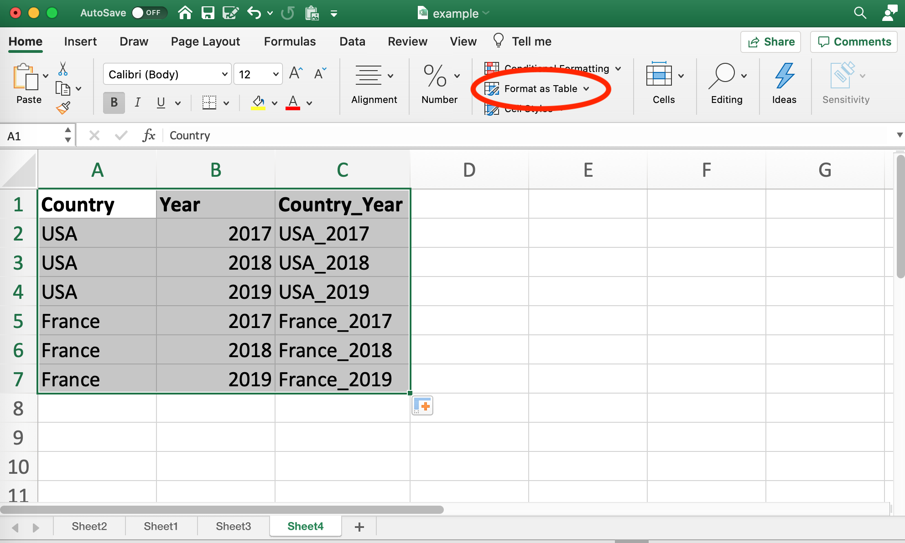
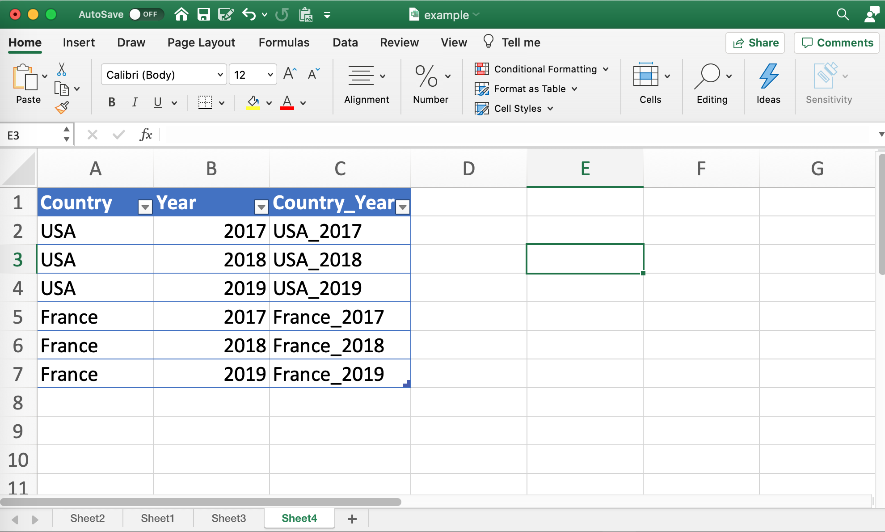
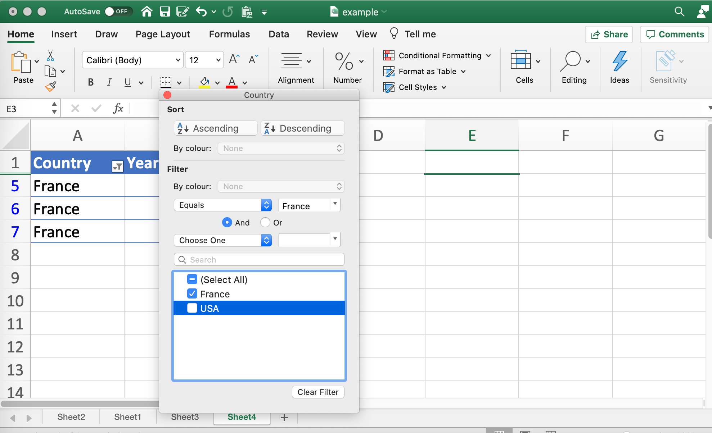
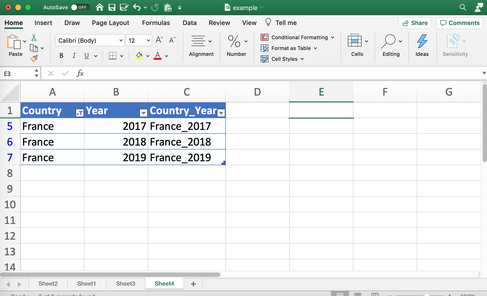

```{r setup, include=FALSE}
library(knitr)
knitr::opts_chunk$set(echo = FALSE)
```

```{r xaringan-themer, include=FALSE, warning=FALSE}
library(xaringanthemer)
style_mono_light(
  base_color = "#23395b",
  header_font_google = google_font("News Cycle"),
  text_font_google   = google_font("Noto serif", "300", "300i"),
  code_font_google   = google_font("Fira Mono"),
  base_font_size = "20px",
  text_font_size = "1.2rem",
  header_h1_font_size = "2.75rem",
  header_h2_font_size = "2.25rem",
  header_h3_font_size = "1.75rem",
  colors = c(
  red = "#f34213",
  purple = "#3e2f5b",
  orange = "#ff8811",
  green = "#136f63",
  white = "#FFFFFF")
)


extra_css <- list(
  ".bottom" = list(
    "position" = "fixed",
    "text-align" = "right",
    "font-family" = "\"Fira Mono\"", 
    "line-height" = 0.7,
    "right" = 0,
    "bottom" = 0,
    "padding-right" = "100px",
    "padding-bottom" = "100px"),
  ".small" = list(
    "font-size" = "0.75rem"),
  ".center" = list(
    "display" = "block",
    "margin-left" = "auto",
    "margin-right" = "auto",
      "width" = "50%"),
  ".large" = list(
    "font-size" = "1.5rem"),
  ".remark-slide-number" = list(
    "opacity" = 0)
  )

style_extra_css(css = extra_css, outfile = "mycss.css")


```


class: title-slide

## Excel training for HKS API-201

<hr> 

<div class="bottom">
<p> September 2020 </p>

</div>

---

## Cleaning data: formatting cells


---

## Cleaning data: CONCAT


---

## Analyzing data: Tables



---

## Analyzing data: Tables



---

## Analyzing data: Tables



---

## Analyzing data: Tables



---

## Analyzing data: Conditional functions


---

class: highlight-last-item

## Analyzing data: Useful functions

- SUM 

--
- COUNT / COUNTA / COUNTBLANK

--
- ABS

--
- AVERAGE

--
- MEDIAN
  + PERCENTILE is a more general version

--
- MODE

--
- MIN / MAX

--
  + LARGE / SMALL are more general versions
  + e.g. LARGE(A1:A5, .red[3]) = the .red[3rd] largest number

--
- Conditional functions:
  + IF
  + SUMIF
  + COUNTIF
  + AVERAGEIF
  + MAXIF / MINIF

---

## Visualizing data: One variable


---

## Visualizing data: Multiple variables


---

## Chart aesthetics

- If you want to *change* some element of your chart (e.g. axis title, bin width), try **double-clicking** on that element

--

- If you want to *add* something to your chart (e.g. trendline), go to Chart Design --> Add Chart Element

--

If you want to save new default settings, create your perfect chart, then right-click and "Save as template". Quit and re-open Excel. You can now apply the template to an existing chart: Chart Design --> Change Chart Type.

---

## Troubleshooting


---

## Resources

**For general learning:**

- LinkedIn Learning Excel courses (available through HKS)

--

<br>

**For specific questions:**
- Google

--

- The teaching team

--


- Each other! (Canvas, Slack)

